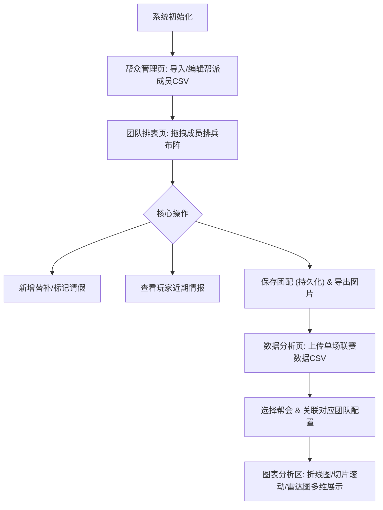

# 联赛数据分析与团队配置系统 - PRD (产品需求文档)

## 1. 产品概述
本系统是一款针对《逆水寒》联赛设计的可视化团队排表与数据分析工具，旨在帮助团长高效管理帮派成员、排兵布阵以及对单场联赛数据进行深度的图表化复盘。
- **主要目的**：整合原有的排表功能，并引入联赛单场数据多维分析能力。
- **目标用户**：联赛团长、数据分析人员。
- **核心价值**：通过高自由度的拖拽排表与直观的数据可视化（雷达图、折线图等），降低指挥门槛，提升数据复盘效率。

## 2. 核心功能

### 2.1 用户角色
| 角色 | 注册方式 | 核心权限 |
|------|---------------------|------------------|
| 管理员/团长 | 本地环境单机使用 | 帮众信息管理、团队排表操作、数据导入与图表分析 |

### 2.2 功能模块
1. **帮众管理模块**：全局帮派成员的列表展示、增删改查、CSV批量导入。
2. **联赛团队排表模块**：可视化拖拽排表、替补/请假标记、悬浮查看近期伤害情报、导出为图片、云端/本地持久化保存团配。
3. **联赛数据分析模块**：单场联赛数据CSV上传、选择分析对象及关联团队配置、小队折线图、团队切片滚动展示、多小队对比雷达图。
4. **内功计算模块**：UI框架入口占位，暂不实现具体逻辑。

### 2.3 页面详情
| 页面名称 | 模块名称 | 功能描述 |
|-----------|-------------|---------------------|
| 全局导航 | 侧边栏/顶部导航 | 切换“帮众管理”、“团队排表”、“数据分析”、“内功计算”页面 |
| 帮众管理页 | 成员列表区 | 展示包含职业、ID、副职、备注、出勤次数等字段的数据表格；提供新增、批量删除和CSV导入入口 |
| 团队排表页 | 待选区 (左侧) | 展示系统内所有帮众，悬停时提示最近三场联赛伤害数据 |
| 团队排表页 | 配置区 (右侧) | 动态创建无限个团队/小队(每队≤6人)，支持左侧与右侧之间、右侧内部的拖拽；包含“增加替补”、“替补(双人占位)”、“请假”等核心操作 |
| 团队排表页 | 操作面板 | 提供“保存图片(导出)”、“保存团配(JSON入库)”功能 |
| 数据分析页 | 数据概览区(左侧) | 上传联赛数据CSV，选择分析帮会与应用的团队配置；展示联赛整体概览数据及核心指标面板 |
| 数据分析页 | 图表分析区(右侧) | 基于所选数据渲染三种核心交互视图：小队折线图、团队数据切片(滚轮翻页展示)、多小队对比雷达图 |

## 3. 核心流程
用户在系统中的典型操作流如下：导入全帮人员 -> 进行赛前排表与人员调整 -> 保存当前阵型 -> 赛后上传比赛数据 -> 关联保存的阵型进行复盘分析。

## 4. UI设计

### 4.1 设计风格
- **主色调与辅助色**：采用深色模式（Dark Mode）为主体，搭配具有电竞或武侠风格的高级色系（如幽蓝色、暗金色），突出数据图表的视觉焦点，避免刺眼的高亮。
- **组件库**：基于 Element Plus 进行深度样式定制，按钮采用微渐变与微3D质感，增强点击反馈。
- **字体**：界面文字要求清晰易读（优先使用系统级无衬线字体及优质中文字体）。
- **布局风格**：模块化卡片布局，大面积留白与清晰的区块分割。排表区及图表区要求最大化利用屏幕空间。
- **动效建议**：使用 CSS 和 ECharts 提供的平滑过渡，拖拽操作（SortableJS）要有明显的占位符（Ghost）和丝滑的放置动画。

### 4.2 页面设计概览
| 页面名称 | 模块名称 | UI 元素 |
|-----------|-------------|-------------|
| 团队排表页 | 待选区/配置区 | 卡片式列表、拖拽手柄、成员职业图标、Tooltip悬浮提示框、状态徽标（请假/替补） |
| 数据分析页 | 概览区/图表区 | 文件上传拖拽区、下拉选择器、大型ECharts容器（折线图/雷达图）、数据卡片（Metric Cards） |

### 4.3 响应式策略
- **桌面端优先 (Desktop-first)**：核心拖拽排表及复杂图表交互主要针对 PC 端显示器（1080p及以上）进行排版与空间利用。
- **移动端适配**：暂不重点适配移动端的复杂拖拽操作，仅提供基础的数据查看与列表展示支持。
