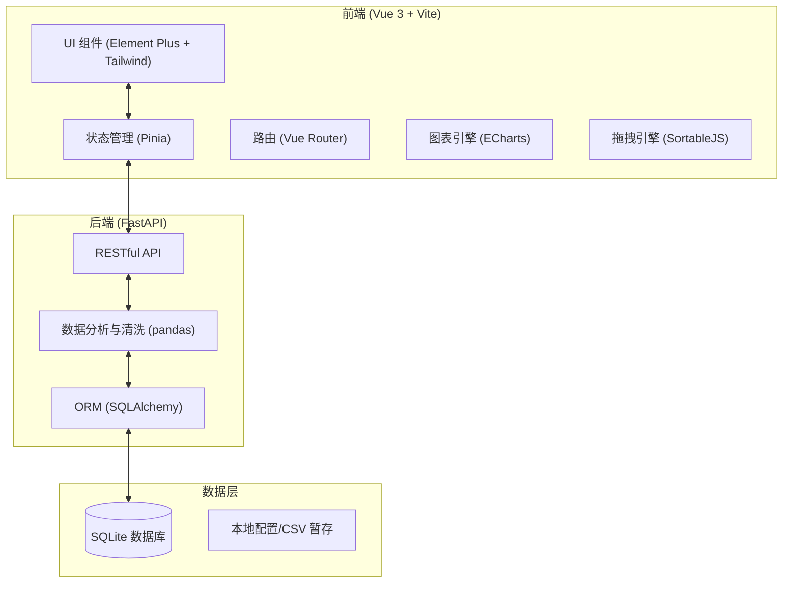
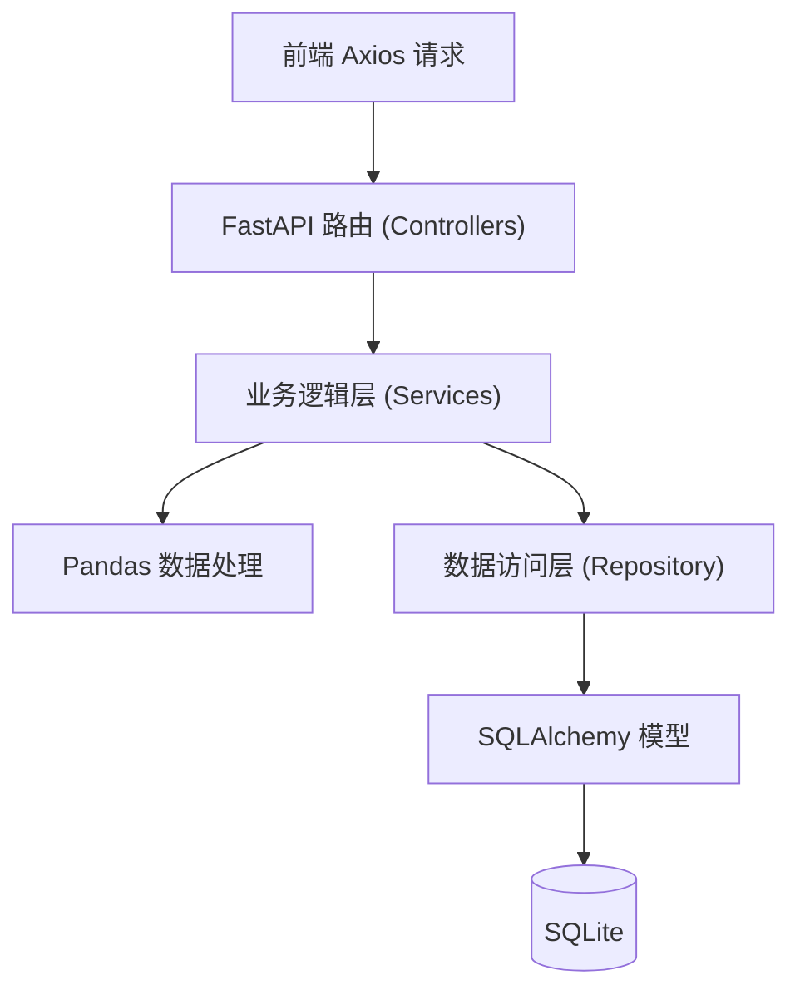
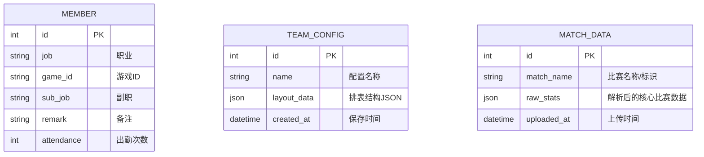

# 联赛数据分析与团队配置系统 - 技术架构文档

## 1. 架构设计
系统采用前后端分离架构，前端负责高强度交互（拖拽排表、图表渲染），后端负责 CSV 文件的解析与数据存储持久化。

## 2. 技术说明
- **前端栈**：
  - 框架：Vue 3 + TypeScript + Vite
  - 状态管理：Pinia (配合 pinia-plugin-persistedstate 用于本地状态恢复)
  - 路由：Vue Router
  - UI 组件库：Element Plus
  - 样式美化：Tailwind CSS
  - 网络请求：Axios
  - 拖拽库：SortableJS (或 vue-draggable-plus)
  - 图表库：Apache ECharts (折线图、雷达图)
  - 截图导出：html2canvas
  - 前端CSV解析（可选用于轻量预览）：PapaParse
- **后端栈**：
  - 框架：FastAPI (Python)
  - ORM：SQLAlchemy
  - 数据校验：Pydantic
  - 迁移工具：Alembic
  - 数据分析引擎：pandas (用于处理联赛单场复杂CSV及后续算法)
- **数据库**：SQLite

## 3. 路由定义 (前端)
| 路由 | 页面组件 | 用途 |
|-------|---------|---------|
| `/` | Dashboard | 系统主入口，展示近期联赛概览及快捷入口 |
| `/members` | MemberList | 帮众管理页，包含成员列表与导入功能 |
| `/team-builder` | TeamBuilder | 联赛团队配置（排表）页 |
| `/analysis` | DataAnalysis | 数据分析页，包含上传CSV及图表展示 |
| `/skills` | SkillCalc | 内功计算模块（目前仅 UI 占位） |

## 4. API 定义 (后端)

### 4.1 帮众管理接口
- `GET /api/members`：获取所有帮众列表
- `POST /api/members`：新增/修改单个帮众信息
- `DELETE /api/members`：批量删除帮众
- `POST /api/members/import`：上传包含帮众信息的 CSV 文件进行批量导入

### 4.2 团队配置接口
- `GET /api/teams`：获取所有已保存的团队配置列表
- `GET /api/teams/{id}`：获取特定团队配置的详细 JSON 结构
- `POST /api/teams`：将当前拖拽排表好的团队配置 JSON 保存到数据库

### 4.3 数据分析接口
- `POST /api/analysis/upload`：上传联赛单场比赛 CSV 数据，解析并返回基础指标
- `GET /api/analysis/team-data`：传入团队配置 ID 与比赛数据 ID，返回聚合到小队级别的雷达图/折线图所需数据结构

## 5. 服务器架构图

## 6. 数据模型

### 6.1 实体关系图

### 6.2 数据定义说明
- **MEMBER 表**：存储所有基础帮派成员信息。
- **TEAM_CONFIG 表**：`layout_data` 字段用于原样存储前端传递的无限极团队/小队树状结构 JSON，便于快速还原上次排表界面。
- **MATCH_DATA 表**：对于上传的联赛 CSV，后端提取关键维度后存入 `raw_stats`（或直接在本地维护文件索引），用于后续结合团队配置动态计算雷达图和折线图数据。
